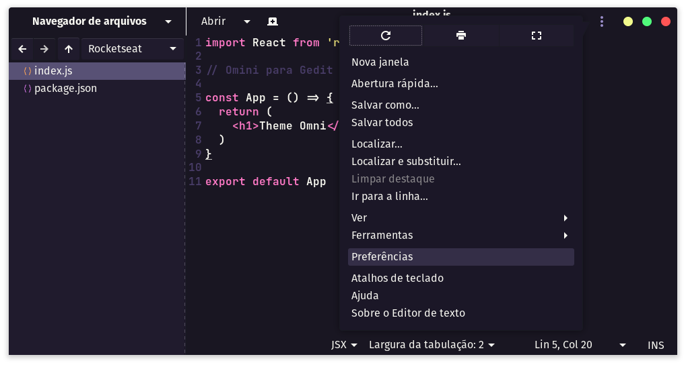
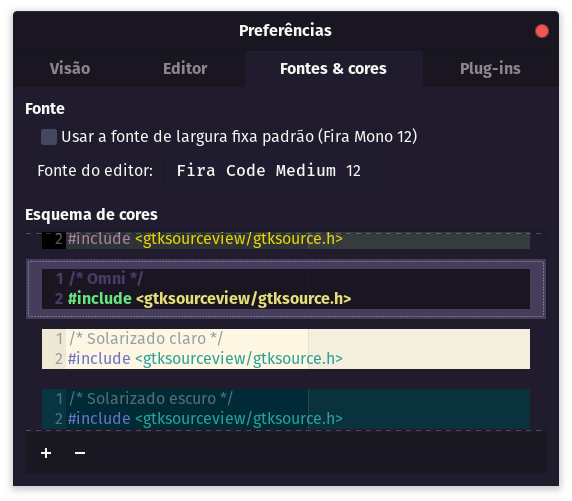

# Omni para [Gedit](https://wiki.gnome.org/Apps/Gedit)


## [Instalar](./INSTALL.md)

```
// Usando https
git clone https://github.com/rafael-camara/gedit-omni.git

// Usando ssh
git clone git@github.com:rafael-camara/gedit-omni.git
```

#### Baixar manualmente

Baixe o tema usando a opção de [download GitHub .zip](https://github.com/rafael-camara/gedit-omni/archive/master.zip) . Depois de baixá-lo, você deve descompactar o arquivo e terá a pasta do tema.

#### Mover o arquivo para a pasta de estilos do Gedit

```bash
$ mv omni.xml $HOME/.local/share/gedit/styles
```

#### Ativando tema

* No Gedit, vá para *Preferências* nos ︙ canto superior direito, clique em *Fontes & cores* - *Esquema de cores* selecione **Omni** para aplicar o tema.





## License

[MIT License](./LICENSE)
